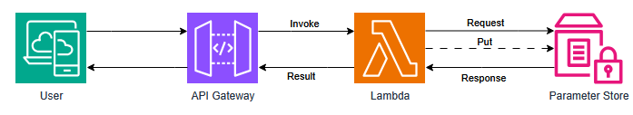
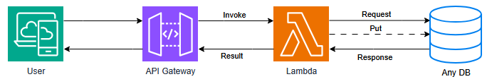
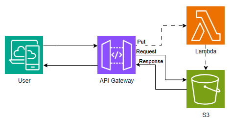

# Solution
The solution implemented to approach the challenge is to use a API Gateway, a Lambda Function and the Parameter Store as shown in the following diagram.



The same Lambda function verify if the API gateway has a parameter or not and this will trigger the change of the dynamic string.
The result is also given by the Lambda Function and it will always read what the parameter store has.

## How to view and update the html page:

At the end of the terraform execution (```terraform apply```) the output will show the URL of the deployment, i.e.

```terraform
Outputs:

URL = "https://<Chars>.execute-api.us-east-1.amazonaws.com/prod"

```
To update the dynamic string it is necessary to update add a parameter to the url, the parameter 'newstring' i.e.
```html
https://<Chars>.execute-api.us-east-1.amazonaws.com/prod?newstring=New String
```

This will update the website and all users will see "New String" on the website.

## Why this solution was chosen
There were a few constrains that led the project to this solution:
- The simplicity of the HTML, did not required a full Instance or a very small one.
- The string to be stored is assumed to be small since it will fit on a h1 of a HTML.
- For user usability it was decided that the user will have access to modify the string easily using a query.
- For user usability it was decided that the base url should be the same to view the string and to modify it.

This led to use serverless solutions that can be easily tested with a small deploy time.

## Other solutions
Direct solutions to this challenge can be obtained used a similar topology:
- Using any database capable of storing a string and able to communicate with lambda.



- Using S3 for static website and Lambda to update the static website.



Other Solutions:
- Using an EC2 with internet access, configuring django, with a local or remote db.

- Using a EC2 with any variation of apache/nginx and modify the files directly

- Using ECS/EKS to store a container to do the same as the previous bullet but containerized.


## How to improve the solution
- Add Cloudfront in front the API Gateway and then add WAF, so it can be protected from DDOS, to avoid extra costs.

- If the solution needs more speed, change the Parameter Store for a database, i.e. DynamoDB.

- Add some cache to avoid calling too much the lambda functions.

- If the solution grows and need a better website, go to the EC2/lightsail/ECS solutions with external DB.

- For the repository, enable github actions to deploy the solution after a PR approve.

- For the terraform state file, store it into S3 to avoid loosing it.

---
@Author: rriquelme